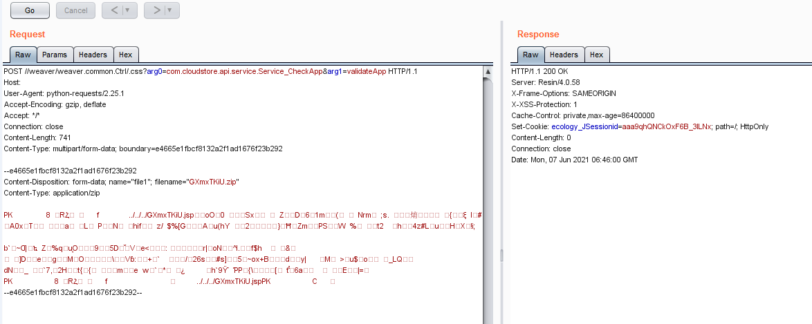

## 泛微 E-Cology weaver.common.Ctrl 任意文件上传漏洞

### 0X 01、漏洞描述

泛微OA weaver.common.Ctrl 存在任意文件上传漏洞，攻击者通过漏洞可以上传webshell文件控制服务器

### 0X 02、漏洞验证

Target + **/weaver/weaver.common.Ctrl/.css?arg0=com.cloudstore.api.service.Service_CheckApp&arg1=validateApp**

<font color=red >如下图：</font>



### 0X 03、漏洞检测相关

****

**规则如下：**

```ruby
alert http any any -> $EXTERNAL_NET $HTTP_PORTS (msg:"泛微 E-Cology weaver.common.Ctrl 任意文件上传漏洞"; flow:established,to_server; content:"weaver.common.Ctrl"; http_uri; nocase; content:"validateApp"; http_uri; nocase; pcre:"/com\.cloudstore\.api\.service\.\w+/iU"; pcre:"/arg[0|1]/iU";classtype:web-application-attack; sid:2020232; rev:1;)
```

### 0X 04、 验证如下

