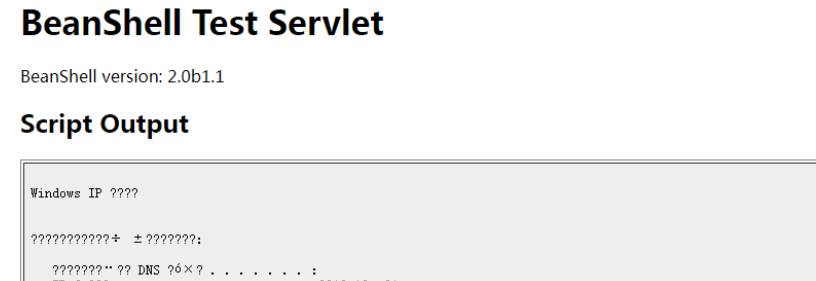

## 用友 NC bsh.servlet.BshServlet 远程命令执行漏洞

### 0X 01、漏洞描述

用友 NC bsh.servlet.BshServlet 存在远程命令执行漏洞，通过BeanShell 执行远程命令获取服务器权限

### 0X 02、漏洞验证

Target + **/servlet/~ic/bsh.servlet.BshServlet**

<font color=red >如下图：</font>



### 0X 03、漏洞检测相关

此处匹配URL+ bsh.script Postdata 字段头部

**规则如下：**

```ruby
alert http any any -> $EXTERNAL_NET $HTTP_PORTS (msg:"用友 NC bsh.servlet.BshServlet 远程命令执行漏洞"; flow:established,to_server; content:"bsh.servlet.BshServlet"; http_uri; nocase; content:"~ic"; http_uri; nocase;  pcre:"/bsh\.script/iP"; classtype:web-application-attack; sid:2020231; rev:1;)
```

### 0X 04、 验证如下


